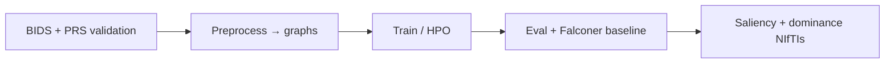

<!-- NeuroSpectral-GNN — KCL Project 65 (pre–data–freeze documentation) -->

# NeuroSpectral-GNN

**Multimodal Siamese Graph Neural Networks for Heritability of Brain Organization**

[](LICENSE)
[](https://www.python.org/downloads/)
[](https://pytorch.org/)
[](#installation)

*NeuroSpectral-GNN* is a **multimodal Siamese Graph Neural Network (GNN) framework** developed for **KCL Project 65** to disentangle **genetic** and **environmental** contributions to **brain structure and function** from **TwinsUK** neuroimaging and genomics. It combines multi-sequence MRI mapped to **SLIC supervoxels** (T1, T2-FLAIR, DWI) with **Polygenic Risk Scores (PRS)**, and learns a representation in which monozygotic (MZ) twin pairs are more similar than dizygotic (DZ) pairs. Learned and classical statistics are **reverse-mapped** into 3D volumes to form **heritability and interpretability atlases** suitable for thesis evaluation and grant reporting.

---

## Motivation in one paragraph

If additive genetic effects shape mesoscale brain organization, then MZ co-twins should exhibit higher concordance for connectivity or morphology-derived phenotypes than DZ co-twins. A **Siamese** encoder with **contrastive** objectives operationalizes that principle on **graph-structured** brain data, while a **genetics** branch encodes high-dimensional PRS. **Cross-modal attention** modulates per-node use of each imaging-derived modality, and outputs can be **compared to classical heritability** (Falconer) estimated directly on the same connectomes.

---

## Architecture overview

### Siamese encoder and contrastive loss

For each family, two **subject graphs** (twins A and B) are encoded into embeddings **z<sub>A</sub>**, **z<sub>B</sub>**. Training encourages **high similarity** for true MZ (and to a lesser degree DZ) pairs and **separation** from unrelated or harder negatives, using a **contrastive** margin in cosine or Euclidean space. **Family-stratified K-fold** splits limit leakage of genetic background across train and validation.

### Graph branch and multimodal fusion

- **Node features** derive from the functional connectome (e.g. **Fisher-z profile** per parcellation / supervoxel) with configurable sparsification (top-k, **proportional**, or thresholded edges).
- **Message passing** uses spectral-style GCN-style layers; edge weights and pooling are configurable in `TrainConfig` / the training CLI.
- **Genetics (PRS)**: a dedicated **MLP** (`genetics_encoder.py`) with **BatchNorm**, **dropout**, and support for **variable effective dimension** in fusion modes.

### Cross-modal attention

When more than one imaging-derived modality is present (e.g. multiple feature blocks per supervoxel), a **transformer-style multi-head attention** block can learn **per-node** weights over modalities before or alongside graph convolutions, enabling **“modality dominance”** analysis for neuroscience interpretation.

### Classical statistical baseline (dissertation / evaluation)

A separate path computes **Falconer** narrow-sense heritability on **raw** connectome-derived **per-node** (and optionally per-edge) scalars, **h<sup>2</sup> = 2(r<sub>MZ</sub> − r<sub>DZ</sub>)** with **Pearson** twin correlations, **clamped to [0, 1]**, and exports NIfTIs and scatter plots **against GNN saliency** for direct comparison. See [Usage examples](#usage-examples) and `scripts/baseline_heritability.py`.

---

## Pipeline workflow (end to end)

1. **Cohort and file validation**  
   Run the BIDS / layout validator with your imaging root and a PRS table to confirm **NIfTI** presence, modality rules (T1, FLAIR, DWI, etc.), and **ID alignment** with **tabular PRS** before any heavy preprocessing.

2. **Preprocessing**  
   BOLD fMRI (or T1/FLAIR/DWI for morphometry pipelines where implemented) is reduced to time series, parcellated or **SLIC-segmented** in 3D, and converted to **Fisher-z** connectomes. Outputs follow a fixed layout: `subjects/{id}.pt` and `pairs.csv` (twin **A/B**, **zygosity**, labels).

3. **Training and hyperparameter optimization**  
   **Family-stratified** cross-validation, optional **heritable auxiliary** losses on synthetic cohorts, and **Optuna** for Bayesian search over learning rate, margin, width, and attention **hyperparameters** (see `scripts/optimize.py`).

4. **Evaluation and ablations**  
   Use validation metrics, h<sup>2</sup>-related diagnostics, and optional **ablation** scripts. Compare to the **Falconer** atlas and correlation with **GNN** saliency.

5. **Interpretability (XAI)**  
   **Integrated gradients** (and related) saliency on node features, **reverse-mapping** to **NIfTI** with `map_nodes_to_volume` (**heritability** / **saliency** atlases) and **modality dominance** atlases from attention (**dominance** = argmax over modalities per supervoxel).



---

## Directory structure

A concise view of the repository layout (Python **src** package, **scripts**, **tests**, **docs**, and run artifacts under **runs**):

```text
NeuroSpectral-GNN/
├── LICENSE
├── README.md
├── requirements.txt
├── requirements-dev.txt
├── pytest.ini
├── docs/
│   └── spectral_primer.md
├── figures/                    # static figures (optional for papers)
├── notebooks/                  # exploratory notebooks
├── runs/                      # local experiment outputs (git-ignored in whole or part)
│   ├── <exp_name>/
│   │   ├── config.json
│   │   ├── fold_NN/           # e.g. best.pt, fold_result.json, tensorboard
│   │   └── ...                # hpo, ablation, or interpretability subfolders
│   └── mock_gallery/          # example NIfTIs from smoke pipeline
├── scripts/                   # CLI entry points (all runnable from repo root)
│   ├── validate_cohort_bids.py
│   ├── preprocess_twins.py
│   ├── generate_synthetic_twins.py
│   ├── train.py
│   ├── optimize.py            # Optuna HPO
│   ├── baseline_heritability.py
│   ├── generate_dominance_atlas.py
│   ├── generate_mock_gallery.py
│   ├── run_ablation.py
│   ├── full_pipeline_test.py
│   └── ...                    # h2_sweep, plot_latent_space, etc.
├── src/                       # importable package
│   ├── analysis/
│   │   ├── heritability.py    # h², Falconer per-feature, embedding metrics
│   │   └── splits.py          # family-stratified K-fold
│   ├── models/
│   │   ├── siamese_gnn.py     # Siamese, fusion, cross-modal MHA
│   │   └── genetics_encoder.py
│   ├── preprocessing/
│   │   ├── bids_validator.py
│   │   ├── slic_supervoxels.py  # 3D SLIC + midline / hemisphere masks
│   │   ├── atlas.py, connectivity.py, graph.py, pipeline.py, ...
│   │   ├── registration.py, synthetic.py, manifest.py
│   │   └── ...
│   ├── training/
│   │   └── trainer.py
│   └── utils/
│       ├── brain_dataset.py, device.py, seeds.py, saliency.py
│       ├── visualization.py  # NIfTI reverse map, bar charts, dominance plots
│       └── synthetic_atlas.py
└── tests/                     # pytest: models, BIDS, SLIC, interpretability, …
```

**Convention:** `runs/<experiment>/` is the recommended home for `config.json`, per-fold checkpoints, **Optuna** exports (`best_config.json`, `optuna_trials.csv`, plots), and interpretability products so thesis figures remain **reproducible** and **separate** from source code.

---

## Installation

### 1. Conda environment (recommended: M1 / Apple Silicon + MPS)

```bash
conda create -n neurognn python=3.10 -y
conda activate neurognn
```

### 2. PyTorch and scientific stack

Install **PyTorch** with the [official instructions](https://pytorch.org/get-started/locally/) for your platform. For current Apple Silicon builds (MPS):

```bash
python -m pip install torch torchvision torchaudio
```

**Verify MPS (optional on Mac):**

```bash
python -c "import torch; print('MPS available:', torch.backends.mps.is_available())"
```

### 3. PyTorch Geometric and neuroimaging dependencies

```bash
python -m pip install torch-geometric
python -m pip install nilearn nibabel scikit-image optuna
python -m pip install -r requirements.txt
```

`requirements.txt` pins additional packages (e.g. **pandas**, **scikit-learn**, **matplotlib**). Use **`python -m pip`** in the same environment to avoid path mismatches.

### 4. Development / tests (optional)

```bash
python -m pip install -r requirements-dev.txt
python -m pytest -q
```

**CPU / CUDA:** The same codebase runs on **CPU**; set device preference in training scripts (`--device auto` chooses **MPS** on supported Macs, else **CUDA** if available, else **CPU**).

---

## Usage examples

### BIDS and PRS cohort validation

Check imaging completeness and **ID crosswalk** to your PRS table (paths below are examples):

```bash
python scripts/validate_cohort_bids.py \
  /path/to/bids_root \
  /path/to/prs_cohort.csv \
  --prs-id-col IID \
  --verify-nib
```

**Inputs:** a **BIDS-like** (or coerced) root with `sub-*` directories and a **CSV/TSV** of PRS columns. Optional: `--globs-json` for project-specific NIfTI patterns, `--csv-out` for a full machine-readable report.

### Optuna hyperparameter optimization

```bash
python scripts/optimize.py \
  --data-root /path/to/cohort_with_subjects \
  --output-dir runs/hpo1 \
  --n-trials 20 --fold 0 --max-epochs 25 \
  --in-channels 100 --use-cross-modal-attention \
  --modality-feature-dims 30 30 40 \
  --device mps
```

**Outputs** (under `runs/hpo1/`): `best_config.json`, `optuna_trials.csv`, and (when visualisation backends are available) HTML/PNG diagnostics such as `optuna_optimization_history.png`. Point training at the best hyperparameters (manually or by merging `best_config.json` into your `TrainConfig` workflow).

### Modality dominance atlas (post-training)

**Dominance** maps the **argmax** over cross-modal **attention** to a supervoxel label NIfTI. You need a **run directory** with `config.json` and `fold_NN/best.pt`, the **cohort** `data-root`, and a **per-subject** SLIC label NIfTI (or auto-discovery under `data-root/derivatives/slic`—see the script’s help).

```bash
python scripts/generate_dominance_atlas.py \
  --run-dir runs/your_experiment \
  --fold 0 --subject-id sub-01234 \
  --data-root /path/to/cohort \
  --output-dir runs/your_experiment/dominance_atlas \
  --device mps
```

### Classical Falconer baseline and saliency comparison

**Per-node** Falconer h<sup>2</sup> on raw connectomes, **NIfTI** output, and optional scatter **vs.** stored **GNN saliency** (1D `numpy` per supervoxel, same order as graph nodes):

```bash
python scripts/baseline_heritability.py \
  --cohort-root /path/to/cohort \
  --slic-labels /path/to/reference_slic_labels.nii.gz \
  --run-dir runs/falconer_baseline1 \
  --phenotype row_mean \
  --saliency-npy /path/to/per_node_saliency.npy
```

**Outputs** default to `runs/falconer_baseline1/baseline_heritability/` (or a custom `--output-dir`): `baseline_falconer_atlas.nii.gz`, `baseline_falconer_h2.npy`, `run_manifest.json`, and `gnn_saliency_vs_falconer_h2.png` when saliency is provided. Add `--export-edges` for a large per–upper-triangle edge h<sup>2</sup> vector.

---

## Main training (cross-validation)

After cohort construction:

```bash
python scripts/train.py \
  --data-root /path/to/cohort \
  --output-dir runs/main_exp \
  --n-splits 5 --max-epochs 60 --batch-size 8 \
  --in-channels 100 --hidden-channels 64
```

`tensorboard` logs (when enabled in your run) can be pointed at the run’s **TensorBoard** subdirectories. For a self-contained pre-data smoke test, see `scripts/full_pipeline_test.py` and the **Tests** section above.

---

## Citation and research context

If you use this code in a thesis, grant, or paper, please cite the repository, license (MIT, see [LICENSE](LICENSE)), and the relevant methodological references for **Falconer heritability**, **twin** designs, and **GNNs** for brain connectivity as per your target venue’s style.

---

## License

This project is released under the **MIT License** — see [LICENSE](LICENSE).

---

## Contact

**KCL Project 65** — for collaboration or data-use questions, follow your institution’s and TwinsUK’s **data governance** rules. For software issues, use GitHub **Issues** on this repository.
